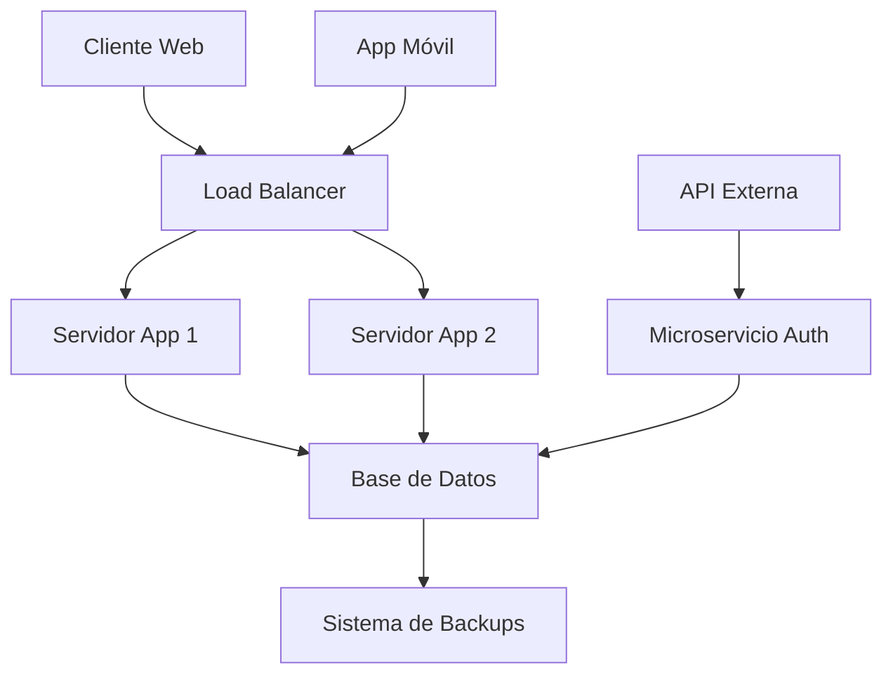

# 📋 Sistema de Gestión Escolar - CotareloManage

Un sistema completo para la gestión de centros educativos modernos.

---

## 🎯 **Descripción General**

**CotareloManage** es una plataforma innovadora diseñada para facilitar la administración de instituciones educativas.  
Combina tecnología avanzada con una interfaz intuitiva para optimizar los procesos académicos y administrativos.

---

## ✨ **Características Principales**

- 👩‍🏫 Gestión de estudiantes y profesorado  
- 📊 Dashboard interactivo con métricas en tiempo real  
- 🧮 Sistema de calificaciones automatizado  
- 💬 Comunicación integrada entre padres, estudiantes y docentes  
- 📈 Reportes personalizables y análisis estadísticos  

---

## 📊 **Estadísticas del Proyecto**

| Métrica              | Valor   | Estado        |
|----------------------|----------|----------------|
| Usuarios activos     | 15,247   | ✅ Activo       |
| Colegios registrados | 342      | 📈 Creciendo   |
| Uptime               | 99.9%    | 🟢 Excelente   |
| Satisfacción         | 4.8/5    | ⭐ Muy alta     |

---

## 🏗️ **Arquitectura del Sistema**



---

## 📈 **Crecimiento de Usuarios**

La ecuación que modela nuestro crecimiento es:

$$
U(t) = U_0 \cdot e^{rt}
$$

Donde:

- \(U(t)\) = usuarios en el tiempo  
- \(U_0 = 500\) (usuarios iniciales)  
- \(r = 0.15\) (tasa de crecimiento mensual)  
- \(t\) = tiempo en meses  

---

## 💰 **Retorno de Inversión (ROI)**

$$
ROI = \frac{Beneficio - Inversión}{Inversión} \times 100
$$

---

## 🔧 **Tecnologías Utilizadas**

**Frontend**
- ⚛️ React.js v18.2.0  
- 🎨 Material-UI  
- 🧩 TypeScript  

**Backend**
- 🟩 Node.js con Express  
- 🗄 MongoDB  
- 🔐 JWT para autenticación  

---

## 📝 **Lista de Tareas Pendientes**

- [ ] Implementar sistema de login  
- [ ] Crear dashboard principal  
- [ ] Añadir módulo de calificaciones  
- [ ] Integrar sistema de notificaciones  
- [ ] Desarrollar app móvil  
- [ ] Implementar analytics avanzados  

---

## 🤝 **Contribuir al Proyecto**

¿Quieres ayudar? ¡Genial!  
1. Haz un **fork** del repositorio  
2. Crea una rama:  
   ```bash
   git checkout -b nueva-funcionalidad
   ```
3. Realiza tus cambios y haz commit  
4. Envía un **pull request**

---

## 📧 **Contacto y Soporte**

- ✉️ Email: [soporte@CotareloManage.es](mailto:soporte@CotareloManage.es)  
- 💬 Slack: [cotarelomanage.slack.com](https://cotarelomanage.slack.com/)  
- 📚 Documentación: [docs.CotareloManage.es](https://docs.cotarelomanage.es/)

---

## 📜 **Licencia**

Proyecto bajo licencia **MIT**. Consulta el archivo `LICENSE` para más detalles.  

Desarrollado con ❤️ por el equipo de **CotareloManage**  
*Transformando la educación digital.* 🎓
